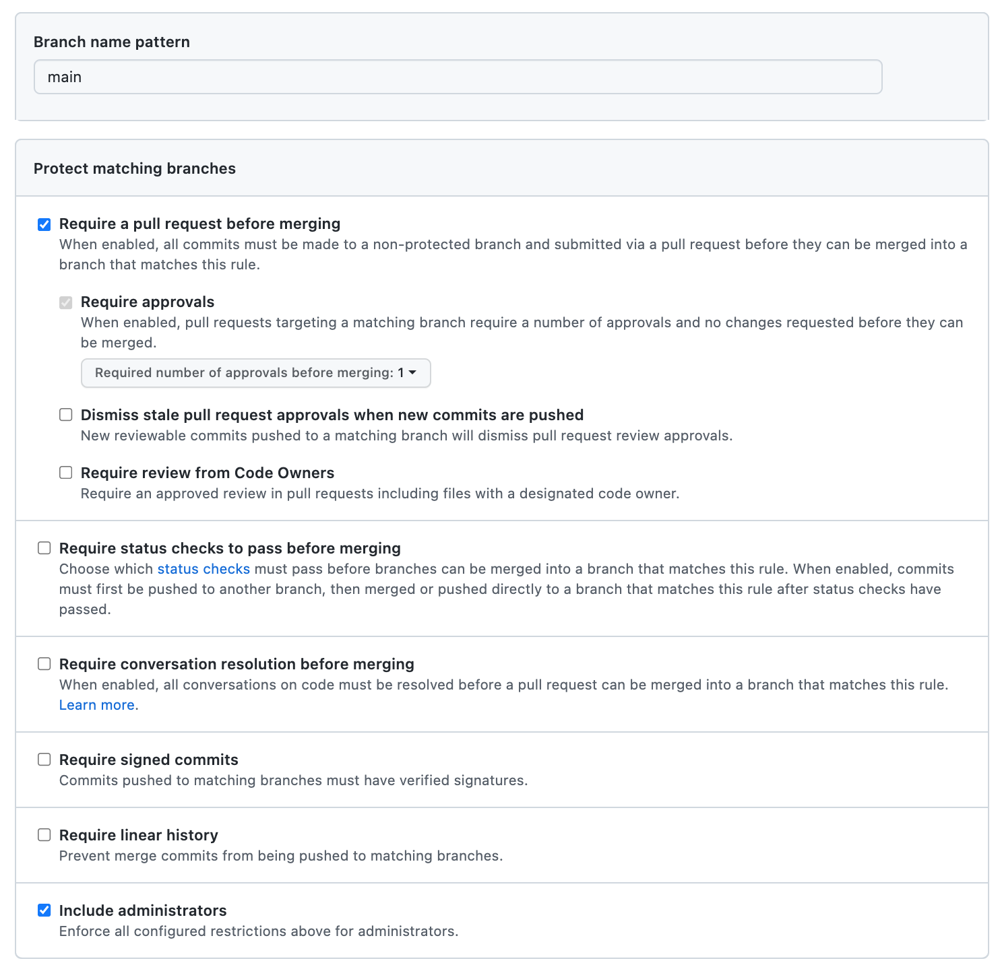

# Python Best Practices Cookiecutter

Best practices [cookiecutter](https://github.com/audreyr/cookiecutter) template as described in this [blogpost](https://sourcery.ai/blog/python-best-practices/).

## Features

- Testing with [pytest](https://docs.pytest.org/en/latest/)
- Formatting with [black](https://github.com/psf/black)
- Import sorting with [isort](https://github.com/timothycrosley/isort)
- Static typing with [mypy](http://mypy-lang.org/)
- Linting with [flake8](http://flake8.pycqa.org/en/latest/)
- Git hook that runs in :
  - pre-commit : Formatting and Sorting

- Deployment ready with [Docker](https://docker.com/)
- Continuous Integration with [GitHub Actions](https://github.com/features/actions)
  - on pull request / push
    - Linting and Static typing
    - Testing
    - Deployment Readiness
  - on push main branch
    - Release using semantic-release

## Quickstart

```sh
# Install pipx if pipenv and cookiecutter are not installed
python3 -m pip install pipx
python3 -m pipx ensurepath

# Install pipenv using pipx
pipx install pipenv

# Use cookiecutter to create project from this template
pipx run cookiecutter gh:Julien-Fruteau/python-best-practices-cookiecutter --checkout vscode-devcontainer

# -------- ALTERNATIVE

# NEW : Develop in a docker container using vscode devcontainer feature, for easy collobaration :
pipx run cookiecutter gh:Julien-Fruteau/python-best-practices-cookiecutter --checkout vscode-devcontainer

# NB: 
#  - When project setup is complete :
#   -> make sure docker desktop is running
#   -> open project in vscode, when prompted to reopen in container, say yes, the container will be built
#   -> disreguard notifications caused by vscode extension being installed
#   -> When the container build is complete, reload the windows so that vscode extensions and py packages newly installed are available
```

## Makefile

This forks started as the wish to be able to auto-commit the code formatting, which cannot be done using pip package pre-commit.

Hence a git hook pre-commit is used instead and set up thanks to a Makefile.

The Makefile is also used by cookiecutter to init the local git repository, prepare the remote github repo configuration, and install dev dependencies.

## Cookiecutter variables

- **project_name** : as displayed as the header of the repo README
- **repo_name** : the github slug, spaces are replaced automatically by dashes "-"
- **module_name** : the python module name, cannot have spaces nor dashes "-", hence replaced by underscores "_"
- **github_user_name** : used to set-up your local git config
- **github_organization** : default to user name but can be replaced if you are targetting an organization repo usage
- **github_user_email** : used to set-up your local git config
- **github_host** : used to configure the github remote origin hostname. Defaults to github.com. This can be useful if you use a [ssh-config-file](https://linuxize.com/post/using-the-ssh-config-file/) in order to address multiple github account from a single localhost (github does not allow the same public ssh key to be used by multiple accounts)

## Repo Usage

- Create an empty github repository which has the **repo_name** set up in cookiecutter
- The 1st commit and chore(setup) commits are made on the main branch and ready to be pushed once you have a created the empty github repository.
  > the push will trigger the release pipeline but intentionnaly will not create a release.
- push main to origin

  ```bash
  git push -u  origin main
  ```

- The consecutive dev should be made on a separate branch corresponding to the feature develop
- Create an switch to new branch

  ```bash
  git checkout -b feat--<my-new-feature>
  ```

- When ready, push the new branch. The test on the remote will start

  ```bash
  git push origin feat--<my-new-feature>
  ```

- Open a pull request, when tests are ok, merge it to the main branch
- A new release will be created
- Repeat for new features, fixes on new branch

### Main branch protection

- The development suggestion made should coincide with the **main branch being protected**, in order to avoid unexpected commit to the remote main branch
- As such the following github Settings/Branches configuration is advised :


> If you're the only administrator you won't be able to merge the PR. You can uncheck 'include administrators' to do the merge, but remember by you doing so, you are also able to push directly to the main branch (this is a warning in case you want to *let it unchecked*).
